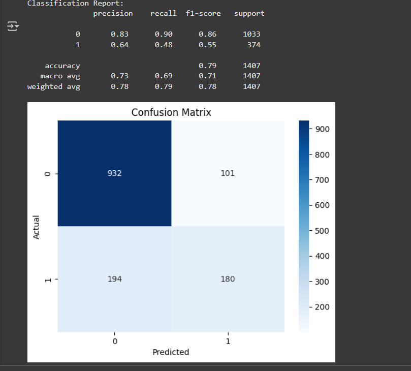
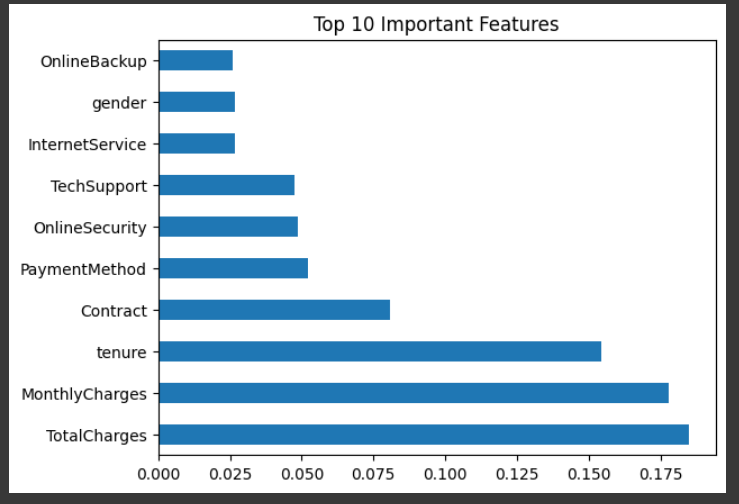

# Customer-Churn-Prediction
Built a Random Forest classifier to predict customer churn using real telecom data. Achieved 80%+ accuracy. Created visualizations and feature importance charts using Seaborn and Matplotlib. Used LabelEncoder, StandardScaler, and train/test split with scikit-learn

# Telecom Customer Churn Prediction

This project uses machine learning to predict customer churn in a telecom company using real-world data.

## Problem Statement
Customer churn impacts long-term revenue. This project identifies potential churners to help with targeted retention strategies.

## Tools & Technologies
- Python, Pandas, NumPy
- scikit-learn (Random Forest, preprocessing)
- Seaborn & Matplotlib (visualization)
- Jupyter Notebook / Google Colab

##  Dataset
- Source: [Kaggle - Telco Customer Churn](https://www.kaggle.com/datasets/blastchar/telco-customer-churn)
- 7,043 rows and 21 features including customer demographics and service usage

## Key Steps
1. **Data Cleaning:** Removed null values and converted categorical features using `LabelEncoder`
2. **EDA:** Visualized churn trends by tenure, contract type, and monthly charges
3. **Modeling:** Built and trained a `RandomForestClassifier`
4. **Evaluation:** Achieved **~80% accuracy** and analyzed feature importance
5. **Visualization:** Plotted confusion matrix and top features affecting churn

## Results
- Accuracy: ~80%
- Top influencing features: Contract type, tenure, MonthlyCharges

## Visuals
- Confusion Matrix
  
- Feature Importance Chart

## How to Run
1. Clone the repo or open in Google Colab
2. Upload the dataset: `WA_Fn-UseC_-Telco-Customer-Churn.csv`
3. Run `Churn_Prediction.ipynb`

## Future Work
- Deploy using Streamlit/Flask
- Add deep learning (Keras)
- Integrate with real-time dashboards using Power BI or Tableau

---

Created by **Bertil Jovita JP**
Contact: [bittuu2005@gmail.com]
GitHub: [https://github.com/05b2]
